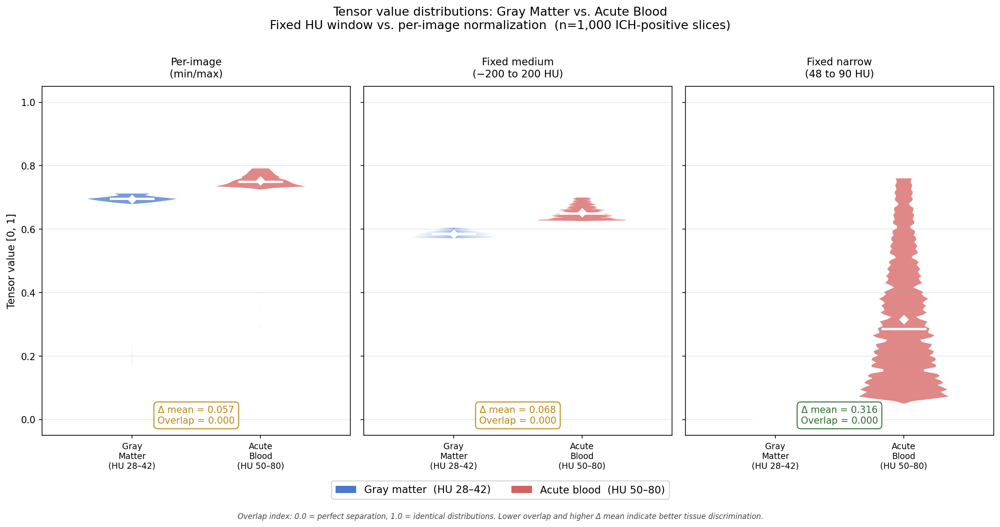

# ICH AI Detection Pipeline

**End-to-end intracranial hemorrhage (ICH) detection: MaxViT classifier +
agentic radiology workflow + browser worklist + DICOM Structured Report**

This repository contains a complete research demonstration of an AI-assisted
ICH screening pipeline built on the RSNA Intracranial Hemorrhage Detection
dataset.  It includes the calibrated CT preprocessing method that underpins
the model, the trained MaxViT classifier, and a fully operational agentic
pipeline that processes DICOM CT head studies and surfaces results on a
browser-based radiology worklist.

---

> The training dataset (RSNA Intracranial Hemorrhage Detection, Kaggle 2019)
> is not included and must be downloaded separately.  The demonstration CT
> studies are sourced from the CQ500 dataset (qure.ai, CC-BY-NC-SA 4.0).
> The trained model checkpoint is hosted on HuggingFace Hub — see
> [Demo](#demo) for download instructions.

---

## Table of Contents

1. [Pipeline Overview](#pipeline-overview)
2. [Demo](#demo)
3. [Agentic Mode — Anthropic API](#agentic-mode--anthropic-api)
4. [Model Performance](#model-performance)
5. [HU Density Overlay](#hu-density-overlay)
6. [Understanding the Statistics — A Bayesian Perspective](#understanding-the-statistics--a-bayesian-perspective)
7. [When to Trust the AI — and When Not To](#when-to-trust-the-ai--and-when-not-to)
8. [Repository Structure](#repository-structure)
9. [Calibrated CT Preprocessing](#calibrated-ct-preprocessing)
10. [Credits and Acknowledgements](#credits-and-acknowledgements)

---

## Pipeline Overview

```
DICOM study folder
        │
        ▼
  scan_study()          ← reads all series headers (no pixel data)
        │
        ▼
  series selection      ← identifies axial noncontrast CT head sequence
        │
        ▼
  run_ich_inference()   ← MaxViT-Base (118 M params, 6-class multi-label)
        │                  per-slice probabilities → study-level aggregation
        ▼
  generate_dicom_sr()   ← DICOM Comprehensive SR with real test-set metrics
        │                  (AUC, Sens, Spec, LR+, LR−, PPV, NPV, Pain Index)
        ▼
  flag_worklist()       ← priority flag if ICH detected
        │
        ▼
  Browser worklist      ← CT slice viewer + SR panel + probability bars
```

All five subtypes are detected independently:
**epidural · intraparenchymal · intraventricular · subarachnoid · subdural**

---

## Demo

### Quick start

```bash
# 1. Clone the repository
git clone https://github.com/rayolddog/ich-maxvit.git
cd ich-maxvit

# 2. Install dependencies
pip install -r requirements.txt

# 3. Download the trained checkpoint (1.4 GB, one time only)
python download_checkpoint.py

# 4. Run the pipeline — processes all 10 demo studies (~16 s on GPU)
python run_demo_direct.py

# 5. Start the worklist server
python ich_worklist.py
# Open http://localhost:5050 in a browser
```

A CUDA GPU is recommended for step 4.  Apple Silicon (MPS) and CPU are
supported — CPU inference takes a few minutes rather than seconds.

---

### Step-by-step details

#### 1 — Install dependencies

All required packages are listed in `requirements.txt`:

```bash
pip install -r requirements.txt
```

A virtual environment is recommended:

```bash
python3 -m venv .venv
source .venv/bin/activate   # Windows: .venv\Scripts\activate
pip install -r requirements.txt
```

#### 2 — Download the trained checkpoint

The model checkpoint (`best_maxvit_ich.pth`, 1.4 GB) is hosted on HuggingFace
Hub and is not included in this repository (too large for GitHub).

```bash
python download_checkpoint.py
```

This saves the file to `checkpoints_maxvit/best_maxvit_ich.pth`.  Run once
after cloning; it is not needed again unless the folder is deleted.

#### 3 — Demo studies

Ten anonymised CT head studies are included in `demo_studies/` (five positive
— one of each hemorrhage subtype — plus five negative controls).

> **Note:** `demo_studies/` is currently excluded pending permission from the
> RSNA Educational Division to redistribute the anonymised DICOM subset.
> If the folder is absent, rebuild it from the full RSNA dataset:
>
> ```bash
> python build_demo_studies.py \
>     --dicom-dir /path/to/rsna/stage_2_train \
>     --labels-csv /path/to/stage_2_train.csv \
>     --out demo_studies
> ```

#### 4 — Run the pipeline

```bash
python run_demo_direct.py
```

Processes all 10 studies without an API key.  For each study: reads DICOM
headers, selects the axial noncontrast series, runs MaxViT inference,
generates a DICOM SR, and populates the worklist.  Takes ~16 seconds on GPU.

#### 5 — Start the worklist server

```bash
python ich_worklist.py
# Open http://localhost:5050 in a browser
```

> **Browser compatibility:** Use **Firefox** or **Microsoft Edge**.
> Google Chrome blocks connections to localhost ports on some platforms
> and may refuse to load the page.

The worklist lists all studies with AI-positive cases flagged at the top.
Click any patient name to open the CT viewer.  The viewer shows the
highest-scoring CT slice, per-subtype probability bars, Bayesian performance
metrics, and a formatted report paragraph ready to paste into dictation
software (PowerScribe or equivalent).  Use the arrow keys to step through
hot slices.  Toggle **HU Overlay** to highlight tissue in the 48–90 HU
acute hemorrhage density range.

### Run the pipeline — with Anthropic API key (optional)

```bash
export ANTHROPIC_API_KEY="sk-ant-api03-..."
python run_demo_agent.py
```

See [Agentic Mode](#agentic-mode--anthropic-api) below.

---

## Agentic Mode — Anthropic API

### What changes with an API key

`run_demo_direct.py` calls the inference tools directly and fills the
radiology report with templated text.  `run_demo_agent.py` instead routes
every study through a **Claude Opus agent** that:

| Step | Direct mode | Agentic mode |
|---|---|---|
| Series selection | Rule-based (modality = CT, no contrast, thinnest slice) | Claude reads all series metadata and reasons about which sequence best meets NCCT head criteria |
| Report paragraph | Fixed template filled with model output | Claude writes a contextualised radiology report paragraph using precise anatomical terminology, PPV/NPV at the specific assumed prevalence, and slice-level localisation |
| Impression bullet | Fixed template | Claude writes a concise impression tailored to the clinical indication |
| Negative reports | Generic NPV statement | Claude acknowledges the indication, explains the NPV at assumed prevalence, and notes any borderline findings |

For the demo the templated reports are accurate and complete.  In a production
or research setting aimed at radiologists, the Claude-written reports are
substantially more informative — particularly for positive studies where the
finding description, anatomical localisation, and clinical context matter.

### When is the API called?

The Claude agent orchestrates the **entire pipeline for every study**,
positive and negative alike.  It must call `scan_study`, select a series,
call `run_ich_inference`, call `generate_dicom_sr`, and write the final
report regardless of the result.  A negative study produces a shorter report
but still passes through the agent.

An architectural optimisation — running direct-mode inference first and only
invoking the agent for positive studies — would reduce API cost by
approximately the fraction of studies that are positive (typically 5–15% in
an ED setting).  This optimisation is not implemented in the current demo but
would be the natural next step for a production deployment.

### Getting an API key

The Anthropic API is billed separately from Claude.ai subscriptions (including
Claude Pro).  There is no required monthly subscription tier — the account is
pay-as-you-go.

1. Go to **[console.anthropic.com](https://console.anthropic.com)**
2. Create an API account and add a payment method
3. Purchase credits (minimum ~$5)
4. Generate an API key under **API Keys**

### Estimated cost

The agent uses `claude-opus-4-6` (Claude Opus).  Each study requires approximately four
API round-trips (scan → inference → SR → report), consuming roughly:

| Token type | Per study | Rate (claude-opus-4-6) | Cost per study |
|---|---|---|---|
| Input | ~3,000 tokens | $15 / 1M tokens | ~$0.045 |
| Output | ~700 tokens | $75 / 1M tokens | ~$0.053 |
| **Total** | | | **~$0.10** |

| Scenario | Studies | Estimated cost |
|---|---|---|
| 10-study demo | 10 | ~$1.00 |
| Typical ED day | 50 | ~$5.00 |
| Busy week | 250 | ~$25.00 |

Switching from `claude-opus-4-6` to `claude-sonnet-4-6` in `ich_agent.py`
reduces cost roughly 5× while still producing high-quality reports.

---

## Model Performance

MaxViT-Base trained from random weights on the RSNA ICH dataset.
Evaluated on the **held-out test set (200,000 slices, never seen during training)**.

| Class | Prevalence | AUC | Sensitivity | Specificity | LR+ | LR− | PPV* | NPV* |
|---|---|---|---|---|---|---|---|---|
| Epidural | 0.42% | 0.985 | 0.939 | 0.944 | 16.76 | 0.065 | 11.8% | 99.97% |
| Intraparenchymal | 4.85% | 0.989 | 0.944 | 0.944 | 16.93 | 0.059 | 46.3% | 99.7% |
| Intraventricular | 3.52% | 0.988 | 0.940 | 0.941 | 15.91 | 0.064 | 37.0% | 99.8% |
| Subarachnoid | 4.79% | 0.983 | 0.946 | 0.941 | 16.07 | 0.057 | 45.1% | 99.7% |
| Subdural | 6.33% | 0.984 | 0.934 | 0.944 | 16.66 | 0.070 | 53.1% | 99.5% |
| **Any ICH** | **14.49%** | **0.986** | **0.940** | **0.945** | **17.18** | **0.064** | **74.0%** | **99.1%** |

\* PPV and NPV computed at the test-set prevalence shown.  These values
change with the local prevalence of the imaging population — the DICOM SR
and worklist viewer recalculate them dynamically.

Thresholds chosen by Youden J (maximising sensitivity + specificity — a
clinically sensible operating point for a screening test where missed ICH
is far more costly than a false alarm).

---

## HU Density Overlay

The CT slice viewer includes an **HU Overlay** toggle button that tints pixels
red wherever tissue density falls in the Hounsfield unit range expected for
acute intracranial hemorrhage (48–90 HU).  This overlay is computed directly
from the raw DICOM pixel data — it is entirely independent of the AI model and
represents a physics-based measurement rather than a learned inference.

### This overlay is not an AI activation map

The HU overlay is computed entirely from raw DICOM pixel values using a fixed
density threshold.  It has no connection to the neural network's internal
representations.  It does not show where the AI detected hemorrhage, and it
does not confirm or explain the AI result.  Its sole purpose is to direct the
radiologist's attention to areas of unexpected high density during review.

### What the red pixels represent

Acute blood has a characteristic density of approximately 50–80 HU on
noncontrast CT, arising from the protein content of haemoglobin.  The overlay
uses the range 48–90 HU, consistent with the narrow window used during model
training, to capture the full range of acute and hyperacute clot densities.

### What the overlay will not highlight — chronic subdural hematoma

Chronic subdural hematomas (typically ≥ 1 week old) undergo lysis and
progressive protein breakdown.  Their density falls progressively from the
acute range (~60–80 HU) toward isodensity with brain parenchyma (~30–40 HU)
and eventually toward CSF density (~0–15 HU) in the chronic-liquefied stage.
By the time a subdural is considered chronic, it is largely or entirely below
the 48–90 HU threshold and **will not be highlighted by the overlay**.

This is clinically important: if the AI flags a study as positive for subdural
hematoma and the overlay shows no red pixels in the expected extra-axial
location, the most likely explanation is a chronic or subacute subdural — not
a false positive.  The AI model was trained on the full RSNA dataset which
includes chronic subdurals; the HU overlay was not.  These are two different
tools measuring different things.

Chronic subdural hematomas, while generally less immediately life-threatening
than acute hemorrhage, still require clinical management and should not be
dismissed because the overlay is unremarkable.

### What else the overlay highlights — expected normal findings

Because the threshold is purely density-based, the overlay will also mark
structures that are entirely normal and should be mentally subtracted:

- **Partial volume averaging at the inner table of the skull** — the most
  prominent normal finding: a bright ring around the brain edge where cortical
  bone averages with adjacent soft tissue.
- **Metal implants and artifact** — surgical clips, shunt hardware, and dental
  or cervical spine metal produce streak artifacts that cross this HU range.
- **Physiological calcifications** — choroid plexus, pineal gland, habenular
  commissure, and basal ganglia calcifications commonly fall in this range.
- **Beam hardening streaks** — dense bone and metal occasionally produce
  adjacent streaks reaching this density range.

### Why it is still clinically useful

An experienced radiologist immediately recognises the normal high-density
structures listed above.  The signal of clinical interest is **unexpected red
pixels in the parenchyma or extra-axial space** — away from bone edges, known
calcification sites, and metal artifacts.

The overlay provides a rapid pre-attentive cue: *is there material in the
hemorrhage density range where there should not be?*

The overlay is complementary to the AI model rather than redundant.  The model
learned statistical patterns across hundreds of thousands of CT slices; the HU
overlay is raw physics.  When the AI flags a slice and the overlay shows
unexpected high-density pixels in the same region, that is two independent
lines of evidence pointing to the same finding — which is reassuring.  When
the AI flags a slice for acute hemorrhage but the overlay shows nothing unusual
at that location, chronic or subacute hemorrhage should be the leading
consideration.

The overlay is not a segmentation tool and has not been validated against
radiologist-drawn regions of interest.  It is a display aid intended to direct
attention, not to replace clinical judgment.

### Where the overlay is most and least useful

The HU overlay is most informative for **subarachnoid, intraparenchymal, and
intraventricular hemorrhage**, where acute blood appears in locations that are
clearly distinct from the normal high-density structures described above.
Unexpected red pixels in the sulci, within the parenchyma, or lining the
ventricular walls are immediately recognisable as abnormal.

The overlay is least reliable for **extracerebral hematomas** (subdural and
epidural), for reasons beyond the chronic subdural density shift already
discussed.  Partial volume averaging at the inner table of the skull produces
a red rim that can mask or mimic an adjacent thin extracerebral collection.
An important exception: in some cases of chronic or subacute subdural
hematoma, the edges of the collection may still be highlighted even when the
bulk of the fluid is isodense.  This occurs because the interface between the
displaced inner cortical surface of the brain and the overlying hyperdense
membrane — a thin split visible between the skull edge and the inwardly
displaced brain margin — may fall within the 48–90 HU range.  Whether this
edge effect is visible depends heavily on the reconstruction algorithm: higher
spatial frequency (detail or bone) kernels produce overshoot at tissue
interfaces through edge enhancement, making the split more apparent; softer
reconstruction kernels suppress it.  This sign is therefore inconsistent and
should not be relied upon as a primary finding.

### Learning curve

Just as radiologists must learn to interpret the marks placed on mammograms
by AI-assisted breast cancer detection systems, there is a learning curve in
using the HU overlay effectively.  The key skill is rapid mental subtraction
of the expected normal findings — the skull rim, calcifications, and any
artifact — to isolate the residual signal.  With experience, the overlay
becomes a fast pre-attentive check rather than a source of uncertainty.

### Future direction

The current implementation uses a fixed HU threshold applied uniformly across
the image.  This is intentionally simple — straightforward to implement,
deterministic, and grounded in established CT physics.  More advanced
approaches using learned segmentation models (such as a MaxViT-based
architecture trained on radiologist-annotated regions) could provide more
anatomically precise localisation, separating true hemorrhage from normal
high-density structures with far greater specificity.  The HU overlay
represents a practical first step; the path to improvement is clear.

---

## Understanding the Statistics — A Bayesian Perspective

The AI model is basically a sophisticated algorithm that detects structures in
images and tests whether those structures match how acute intracranial hemorrhage
appears on CT scans.  The model is effective at determining whether a detected
structure is likely to represent an area of hemorrhage.  Because of extensive
training on noncontrast CT images of the head, it is possible to determine how
likely a finding represents intracranial hemorrhage.

The likelihood that a given structure represents hemorrhage is expressed by the
Bayesian inference statistics of likelihood ratio, prevalence of disease, and
positive and negative predictive value.  The most important results are the two
statistics: **Positive Predictive Value (PPV)** and **Negative Predictive Value
(NPV)**.

Because of the low prevalence of intracranial hemorrhage in the general patient
population undergoing head CT, even a powerful test will likely result in fewer
than 30% of AI-identified cases representing true positive results.  That
interpretation of positive test results used to identify rare diseases is a
principle we all learned in medical school.

The **Pain Index** (FP:TP ratio) quantifies the practical consequence of this
reality: for each true hemorrhage the AI correctly identifies, the radiologist
must review and override this number of incorrect AI-positive flags — representing
additional review time and cognitive load under the time pressure of clinical
practice.

### The numbers in context — and why published AI metrics feel different in practice

The headline performance statistics that accompany any AI classifier — AUC,
sensitivity, specificity, and especially PPV — are typically computed on the
held-out **test dataset**, which is usually **enriched for positive cases**
relative to an unselected clinical population.  The RSNA test set used to
produce the performance table above has an "any ICH" prevalence of 14.5%
(14.49% exact).  An unselected emergency department CT head population has a
true ICH prevalence closer to **2%** — consistent with published epidemiology
and with the lived experience of radiologists reading volume ED CT at busy
trauma centres, past and present.

Sensitivity and specificity are **intrinsic** to the model and do not change
with prevalence.  **PPV and the false-positive burden are not** — they are
dominated by prevalence.  This is the principal reason clinicians trying out
an AI in practice often feel the tool underperforms the published numbers:
the metrics they read were computed on a population very different from the
one in front of them.  The AI is behaving exactly as advertised; the
denominator has changed.

The two tables below use the **same model with identical sensitivity (94%)
and specificity (94.5%)**.  Only the prevalence differs.

**Test-set prevalence (14.5%)** — the population used to compute the
performance table above.

| 1,000 patients | AI Positive | AI Negative |
|---|---|---|
| True ICH (145) | **136 detected** | 9 missed |
| No ICH (855) | 47 false alarms | **808 correctly cleared** |

PPV = 136 / (136 + 47) = **74%** — roughly 1 in 4 AI-positive flags is a false alarm.
NPV = 808 / (808 + 9) = **99.0%** — a negative AI result is highly reliable.
Pain Index = 47 / 136 = **0.35** — the radiologist encounters approximately
1 false positive for every 3 true detections.

**Unselected ED prevalence (2%)** — realistic for a busy emergency department
scanning head CT for the broad mix of indications that actually drive
utilisation: non-specific headache, dizziness, altered mental status, syncope,
and minor trauma.

| 1,000 patients | AI Positive | AI Negative |
|---|---|---|
| True ICH (20) | **19 detected** | 1 missed |
| No ICH (980) | 54 false alarms | **926 correctly cleared** |

PPV = 19 / (19 + 54) = **26%** — roughly **3 in 4 AI-positive flags are false alarms**.
NPV = 926 / (926 + 1) = **99.9%** — a negative AI result is extremely reliable.
Pain Index = 54 / 19 = **2.9** — the radiologist reviews and overrides roughly
**3 incorrect AI-positive flags for every true hemorrhage detected**.

### What changes, what does not

Moving from the 14.5% test-set benchmark to the 2% real-world prevalence:

- PPV collapses from 74% to 26% — a **2.8× degradation** driven entirely by
  the shrinking positive denominator.
- Pain Index rises from 0.35 to 2.9 — an **8× increase** in the false-positive
  review burden per true detection.
- NPV actually *improves* (99.0% → 99.9%), because the prior probability of
  disease is lower to begin with.  The negative AI result is, if anything,
  more reliable in a low-prevalence population.
- Sensitivity, specificity, AUC, LR+, and LR− are unchanged — they are
  properties of the model, not the population.

This is not a model failure, a calibration problem, or a training artefact.
It is the unavoidable arithmetic of Bayes' theorem applied to a rare
condition.  The same phenomenon applies to D-dimer testing, mammography,
low-dose screening CT for lung cancer, and every other screening test in
medicine.  It is a principle every clinician learned in medical school —
and one that is easy to forget when a vendor quotes a single PPV number.

The practical consequence is that **every AI performance metric reported
without an explicit prevalence is clinically incomplete**.  The DICOM SR
generated by this pipeline records the assumed prevalence alongside every
PPV/NPV calculation, and the worklist viewer recalculates them dynamically
for each study's clinical context — so the radiologist always sees the
statistics that match their own population, not the enriched-dataset
benchmark.

---

## When to Trust the AI — and When Not To

The statistics in this pipeline exist for one purpose: to help the radiologist
know when to act on the AI result and when to look more carefully.  They do not
replace clinical judgment — they inform it.

### The AI result should never be ignored

A positive AI flag directs attention to a specific slice in a specific study.
That direction has value even when the AI is wrong.  A closer second look at
the flagged slice almost always resolves the question: either the hemorrhage
is visible on review, or it is not.  An AI positive that the radiologist cannot
confirm after careful review should be rejected — and that rejection is itself a
clinical act, documented and considered, not a passive dismissal.

### The AI can never be 100% correct

This is not a limitation unique to AI.  It is a property of any probabilistic
test applied to a heterogeneous biological signal.  Radiologists, experienced
clinicians, and advanced imaging all operate with uncertainty.  What the
statistics provide is a quantified, reproducible characterisation of that
uncertainty — something that is rarely available for unaided human judgment.

### Reading the statistics clinically

**NPV — the most powerful result in a low-prevalence population.**
Across the full realistic range of emergency department prevalence (2–15%),
the NPV exceeds 99%.  A negative AI result carries very high confidence that
ICH is absent.  The routine read proceeds without modification to workflow
priority.  In fact, NPV is highest — approaching 99.9% — at the lowest
prevalence, where the prior probability of disease is smallest.

**PPV — honest about the cost of false positives.**
Across the same 2–15% range, PPV varies dramatically: roughly **74% at the
14.5% test-set prevalence**, falling to roughly **26% at an unselected 2% ED
prevalence**.  Most AI performance tables are reported at or near test-set
prevalence, which materially overstates the PPV a radiologist will see in
practice.  In an unselected ED population the majority of AI-positive flags
will not be confirmed by the radiologist.  This is not a model failure — it
is the mathematical consequence of applying a powerful test to a rare
condition, a principle covered in every medical school curriculum.  The PPV
is recalculated dynamically for the specific prevalence of each patient's
clinical context, so the statistic displayed to the radiologist reflects
their actual population rather than the enriched benchmark.

**Pain Index — the practical workflow cost.**
The Pain Index (FP:TP ratio) quantifies the number of incorrect AI-positive
flags the radiologist must personally review and override for each true
hemorrhage detected.  Each override is an additional act of scrutiny performed
under clinical time pressure.  The Pain Index is strongly prevalence-dependent:
at 14.5% test-set prevalence it is approximately 0.35 (one false positive for
every three true detections), but at an unselected 2% ED prevalence it rises
to approximately 2.9 (roughly three false positives for every true detection).
Whether this burden is acceptable is a local clinical judgment — but it is a
burden that should be anticipated honestly, not discovered in practice after
the AI has been deployed against published test-set statistics that assumed
a denser positive population.

**LR+ and LR− — for Bayesian reasoning.**
The likelihood ratios allow the radiologist or referring clinician to update
their pre-test probability with the AI result, using standard Bayesian
reasoning.  LR+ of 17 means a positive AI result multiplies the odds of ICH
by a factor of 17.  LR− of 0.064 means a negative result reduces the odds
to approximately 1/16 of their prior value.

### The irreducible role of the radiologist

The statistics define the operating characteristics of the model as measured
on held-out test data.  They do not guarantee performance on any individual
case.  An unusual hemorrhage presentation, image quality degradation, patient
motion, or a subtype underrepresented in the training data may all cause the
model to underperform its aggregate metrics.

The radiologist's training, pattern recognition, and clinical context remain
the final arbiter.  The AI is a screening tool that ensures no study passes
unremarked — not a replacement for the judgment that comes from years of
training in the interpretation of CT anatomy.

---

## The Problem with Per-Image Normalization

The standard image preprocessing idiom — normalizing each image by its own
minimum and maximum pixel value — is destructive when applied to CT data:

```python
# WRONG for CT — destroys Hounsfield calibration
tensor = (image - image.min()) / (image.max() - image.min())
```

CT pixel values are not arbitrary intensity values.  They are **Hounsfield
Units (HU)**, a calibrated physical scale defined so that:

- Water = 0 HU (by definition)
- Air   = −1000 HU (by definition)

Every CT scanner in clinical use is calibrated to this scale.  A pixel value
of 65 HU means the same thing — the density of acute blood — regardless of
which scanner, which patient, or which slice produced it.

Per-image normalization maps that value to a different float every time,
depending on what else is in the image.  A bright slice (large hemorrhage) and
a dim slice (thin subdural) will encode the same 65 HU blood pixel at
completely different tensor values.  The physical information is discarded.

---

## The Solution: Fixed HU Window Encoding

Map a **fixed, globally-defined HU range** linearly to `[0.0, 1.0]`:

```
tensor = clip( (HU − hu_low) / (hu_high − hu_low),  0.0,  1.0 )
```

Values below `hu_low` → `0.0`.  Values above `hu_high` → `1.0`.
Values in between → linear.  The same HU value always produces the same
tensor value, across all slices and all patients.

---

## Hounsfield Unit Reference

| Tissue | HU range |
|---|---|
| Air (external) | −1000 |
| Fat | −100 to −50 |
| Water / CSF | 0 to 15 |
| White matter | 20 to 30 |
| Gray matter | 30 to 42 |
| **Acute ICH / blood** | **50 to 80** |
| Hyperacute clot | 80 to 100 |
| Cortical bone | 300 to 1000 |
| Metal / hardware | > 1000 |

---

## Three Window Presets

Defined in [`hu_windows.py`](hu_windows.py):

### Wide window — `WINDOW_WIDE`
```
HU range : −1024 to 3071  (4095 HU span)
```
Full practical CT range.  Covers air, fat, water, soft tissue, bone, and
metal without saturation.  The contrast between similar soft tissues is
compressed to a small fraction of `[0, 1]`.

**Gray matter → blood delta: ~0.007**

Use for: multi-tissue classification, bone and implant tasks.

### Medium window — `WINDOW_MEDIUM`
```
HU range : −200 to 200  (400 HU span)
```
Soft-tissue and early-bone range.  Excludes bulk air and dense bone.
Captures fat, water, CSF, brain parenchyma, blood, and early cortical bone.

**Gray matter → blood delta: ~0.068**

Use for: brain anatomy, ICH in anatomical context.

### Narrow window — `WINDOW_NARROW`
```
HU range : 48 to 90  (42 HU span)
```
Acute ICH detection range.  Gray matter, CSF, white matter, fat, and air
all map to `0.0`.  Only the acute blood density band occupies `[0, 1]`.

**Gray matter → blood delta: ~0.316  (5.5× wider than per-image)**

Use for: maximum ICH vs. normal brain pixel contrast.

---

## Experimental Validation

The figure below compares tensor value distributions for gray matter
(HU 28–42) and acute blood (HU 50–80) pixels across 1,000 ICH-positive CT
slices from the RSNA Intracranial Hemorrhage Detection dataset (n = 28.3M
gray matter pixels, 5.6M blood pixels).



| Scheme | Gray matter (mean ± std) | Acute blood (mean ± std) | Δ mean | GM std ratio |
|---|---|---|---|---|
| Per-image (min/max) | 0.695 ± 0.022 | 0.752 ± 0.022 | 0.057 | 1.0× (baseline) |
| Fixed medium (−200 to 200 HU) | 0.586 ± 0.009 | 0.653 ± 0.020 | 0.068 | **2.4× tighter** |
| Fixed narrow (48 to 90 HU) | 0.000 ± 0.000 | 0.316 ± 0.190 | **0.316** | ∞ (constant) |

Key observations:
- **Δ mean**: the fixed narrow window achieves 5.5× greater separation between
  gray matter and acute blood than per-image normalization.
- **Gray matter std**: per-image normalization maps the same gray matter tissue
  to different tensor values depending on the slice content (std 0.022).
  The fixed medium window reduces this variance by 2.4× (std 0.009), reflecting
  the physical reality that gray matter density is consistent across patients.
- **Fixed narrow**: gray matter is entirely below the window floor and maps
  exactly to 0.0 on every slice.  The blood distribution's spread (std 0.190)
  captures genuine biological variance in clot density and age.

Experiment code: [`compare_normalization.py`](compare_normalization.py)

---

## ICH Classification Results

To validate that the calibrated encoding provides actionable signal for deep
learning, a SE-ResNeXt50 classifier was trained from **random weights** (no
ImageNet pretraining) on the narrow-window cache (HU 48–90 → [0.0, 1.0]).

**Training configuration:**
- Architecture: SE-ResNeXt50 (25.5M parameters), single-channel input
- Loss: Focal loss (γ=2.0) with label smoothing (0.05)
- Optimizer: AdamW, LR 3×10⁻⁴ with cosine decay, batch size 32
- Dataset: RSNA Intracranial Hemorrhage Detection (Kaggle 2019)
  - Train+val: 544,685 slices  |  Test: 200,000 slices (held out)
- Cache encoding: `WINDOW_NARROW` (48–90 HU), corrected fixed-window

**Final test set results (200,000 held-out slices, best checkpoint epoch 25):**

| Class | Prevalence | AUC | Sensitivity | Specificity | LR+ | LR− |
|---|---|---|---|---|---|---|
| Epidural | 0.42% | 0.966 | 0.891 | 0.924 | 11.68 | 0.118 |
| Intraparenchymal | 4.85% | 0.963 | 0.881 | 0.917 | 10.61 | 0.130 |
| Intraventricular | 3.52% | **0.976** | 0.914 | 0.931 | 13.19 | 0.092 |
| Subarachnoid | 4.79% | 0.936 | 0.875 | 0.847 | 5.71 | 0.147 |
| Subdural | 6.33% | 0.957 | 0.878 | 0.901 | 8.90 | 0.135 |
| Any ICH | 14.49% | 0.959 | 0.880 | 0.901 | 8.91 | 0.133 |
| **Mean** | | **0.960** | | | | |

Thresholds were chosen by Youden J (maximising sensitivity + specificity) on
the test set.  LR+ and LR− are likelihood ratios for positive and negative
results respectively — directly useful for Bayesian clinical reasoning.

**Significance of random-weight initialisation:**  A prior run using the same
architecture with ImageNet-pretrained weights but an incorrectly encoded cache
(wrong HU recovery formula, 0.05–0.95 window margins) reached a best
validation AUC of only 0.897 at epoch 29.  The corrected encoding with random
weights surpassed that result at **epoch 2** (AUC 0.903) and reached 0.960 on
the held-out test set.  This demonstrates that the calibrated HU encoding, not
the pretrained weights, is the primary driver of model performance.

---

## Repository Structure

```
NewICH/
│
├── ── AI Pipeline ──────────────────────────────────────────────────────────
│
├── ich_agent.py               # Anthropic tool-use agent (agentic mode)
│                              # scan_study → series select → inference →
│                              # DICOM SR → worklist → natural-language report
│
├── ich_inference.py           # MaxViT inference engine
│                              # Loads checkpoint, runs per-slice → study-level
│                              # aggregation, returns hot slices + probabilities
│
├── ich_dicom_sr.py            # DICOM Comprehensive SR generator
│                              # Encodes AI findings, test-set metrics (AUC,
│                              # Sens, Spec, LR+, LR−, PPV, NPV, Pain Index)
│                              # Loads live metrics from test_metrics.json
│
├── ich_worklist.py            # Flask browser worklist + CT slice viewer
│                              # Serves real DICOM PNGs via /api/slice_image
│                              # Two-panel modal: CT slice + SR content
│
├── prevalence_db.py           # SQLite prevalence tracking database
│                              # Per-location, per-period prevalence queries
│                              # Feeds local prevalence back to agent
│
├── prevalence_scanner.py      # Batch archive scanner (requires --confirm)
│                              # Processes historical CT studies to seed DB
│
├── ── Demo ─────────────────────────────────────────────────────────────────
│
├── build_demo_studies.py      # Reconstructs 10 studies from RSNA slices
│                              # 5 positive (one per subtype) + 5 negative
│
├── run_demo_direct.py         # ★ Run demo without API key
│                              # Calls tools directly, templated report text
│
├── run_demo_agent.py          # Run demo via Claude agent (API key required)
│                              # Natural-language series selection + reports
│
├── demo_studies/              # Built by build_demo_studies.py
│   ├── manifest.json
│   ├── positive/
│   │   ├── subdural__<uid>/      *.dcm + ich_ai_sr.json
│   │   ├── epidural__<uid>/
│   │   ├── intraparenchymal__<uid>/
│   │   ├── intraventricular__<uid>/
│   │   └── subarachnoid__<uid>/
│   └── negative/
│       └── negative__<uid>/  (×5)
│
├── worklist.json              # Persisted worklist (auto-created)
│
├── ── Model & Training ─────────────────────────────────────────────────────
│
├── maxvit_model.py            # MaxViT-Base definition (timm-based)
├── maxvit_trainer.py          # Training loop (focal loss, cosine LR, BF16)
├── MaxVITDataset.py           # Dataset: .npz cache → (image, label) tensor
│
├── checkpoints_maxvit/
│   ├── best_maxvit_ich.pth    # Trained checkpoint (epoch 18, AUC 0.9877)
│   ├── test_metrics.json      # Held-out test metrics (200 k slices)
│   └── prevalence.db          # Local prevalence SQLite database
│
├── evaluate_maxvit_test.py    # Reproduce test metrics from cache tensors
│
├── ── Calibrated CT Preprocessing ──────────────────────────────────────────
│
├── hu_windows.py              # HUWindow dataclass, 3 presets, apply_window()
├── dicom_reader_1ch.py        # Robust DICOM → HU reader (pydicom)
├── build_medium_cache.py      # Medium-window DICOM → .npz cache builder
├── build_cache_zig.py         # High-throughput Python + Zig cache builder
├── compare_normalization.py   # Experiment: per-image vs. fixed-window
│
└── hu_tensor/                 # Zig shared library
    ├── build.zig
    └── src/hu_tensor.zig      # apply_window(), apply_three_windows() (C ABI)
```

---

## Calibrated CT Preprocessing

The MaxViT classifier is trained on tensors encoded with a **fixed Hounsfield
Unit window** rather than per-image normalization.  This preserves the physical
meaning of CT pixel values across all slices and patients — the key insight
that allows the model to learn density-based ICH features rather than
relative-brightness features.  Full discussion below.

---

## Installation

### Requirements

```bash
pip install pydicom numpy pandas scipy matplotlib
```

Python 3.10+ recommended.  The pure Python implementation has no other
dependencies.  The hybrid Zig implementation requires Zig 0.15.x (see below).

### Zig (for hybrid implementation, AMD64 Ubuntu)

Install Zig 0.15.x via snap:

```bash
sudo snap install zig --classic --channel=0.15.x/stable
```

Or download a binary from [ziglang.org/download](https://ziglang.org/download/)
and place `zig` on your PATH.

Build the shared library:

```bash
cd hu_tensor
zig build -Doptimize=ReleaseFast
```

Output: `hu_tensor/zig-out/lib/libhu_tensor.so`

Verify:

```python
from build_cache_zig import _load_lib
lib = _load_lib('hu_tensor/zig-out/lib/libhu_tensor.so')
print(lib.hu_tensor_version())   # → 10000  (version 1.0.0)
```

---

## Usage

### Pure Python — single window

```python
import numpy as np
from hu_windows import apply_window, WINDOW_NARROW, WINDOW_MEDIUM, WINDOW_WIDE

# hu is a float32 ndarray of Hounsfield values (from dicom_reader_1ch)
tensor = apply_window(hu, WINDOW_NARROW)   # → float16, shape (512, 512)
np.savez_compressed('slice.npz', image_norm=tensor)
```

### Build a cache — pure Python

```bash
# Medium window (−200 to 200 HU)
python build_medium_cache.py \
    --dcm-dir  /path/to/dicom/root \
    --train-dir /path/to/cache_medium_train \
    --test-dir  /path/to/cache_medium_test \
    --splits-file ./checkpoints_1ch/data_splits.json \
    --workers 8

# Wide window (−300 to 180 HU, brain/blood window)
python build_1ch_cache.py \
    --dcm-dir    /path/to/dicom/root \
    --output-dir /path/to/cache_wide \
    --workers 8
```

### Build a cache — hybrid Python + Zig (faster)

```bash
# Single window
python build_cache_zig.py \
    --dcm-dir /path/to/dicom/root \
    --window medium \
    --workers 8

# All three windows in one DICOM pass (most efficient)
python build_cache_zig.py \
    --dcm-dir /path/to/dicom/root \
    --window all \
    --workers 8
```

The `--window all` mode calls `apply_three_windows()` in the Zig library,
reading each DICOM pixel array once and writing wide, medium, and narrow tensors
simultaneously — one third the memory bandwidth of three separate runs.

### Run the normalization experiment

```bash
python compare_normalization.py \
    --cache-dir /path/to/cache_1ch \
    --labels    /path/to/stage_2_train.csv \
    --n 1000 --workers 8
```

---

## DICOM to HU Conversion

The conversion from raw DICOM pixel values to Hounsfield Units uses the
metadata stored in the DICOM header, as defined by the DICOM standard:

```
HU = pixel_value × RescaleSlope + RescaleIntercept
```

`RescaleSlope` is 1.0 for virtually all CT scanners.
`RescaleIntercept` is typically −1024 for modern CT scanners.

`dicom_reader_1ch.py` applies four validation rules to exclude invalid files:

1. File must be readable by pydicom
2. `pixel_array` must be decodable and 2-dimensional
3. `BitsAllocated` must be in `{8, 16, 32, 64}`
4. Resulting HU range must be plausible (rejects uncalibrated integer files,
   scout/localizer images, and files where the intercept was not applied)

Files lacking `RescaleIntercept` fall through to a scanner-convention
fallback (`uint16 − 1024`) and are subject to rule 4 validation.

---

## Zig Library API

The Zig shared library exports two functions via C ABI, callable from any
language with a C FFI (Python ctypes, Rust, C, etc.):

```c
// Single window: hu[n] → output[n] (float16 stored as uint16 bit patterns)
void apply_window(
    const float* hu,
    size_t n,
    float hu_low,
    float hu_high,
    uint16_t* output
);

// Three windows in one pass — 1/3 the memory bandwidth of three calls
void apply_three_windows(
    const float* hu, size_t n,
    float lo0, float hi0,    // window 0 (e.g. wide)
    float lo1, float hi1,    // window 1 (e.g. medium)
    float lo2, float hi2,    // window 2 (e.g. narrow)
    uint16_t* out0,
    uint16_t* out1,
    uint16_t* out2
);

// Returns library version as major*10000 + minor*100 + patch
uint32_t hu_tensor_version(void);
```

Output arrays contain `float16` values stored as `uint16` bit patterns.
In Python: `np.frombuffer(out, dtype=np.uint16).view(np.float16)`.

---

## Data

Experiments use the
[RSNA Intracranial Hemorrhage Detection](https://www.kaggle.com/c/rsna-intracranial-hemorrhage-detection)
dataset (Kaggle, 2019).  The dataset is not included in this repository.
Labels file: `stage_2_train.csv`.

---

## Credits and Acknowledgements

### Authors

**John B. Bramble, MD**
Concept, clinical domain expertise, and research direction.
The principle of encoding CT pixels using fixed Hounsfield Unit windows rather
than per-image normalization was developed and validated through iterative
experimentation with multiple neural network architectures and window widths.
This work continues a personal research interest in computer-aided diagnosis
that began in the late 1980s, when Dr. Bramble developed an early CAD system
for arthritis classification in C on a Commodore Amiga, working under
Samuel J. Dwyer III (a principal architect of the DICOM standard) and
Lawrence L. Cook at the University of Kansas Medical Center.

**Claude Sonnet (Anthropic)**
Implementation of all source files in this repository, including the HU
windowing library, DICOM reader, cache builders, MaxViT training pipeline,
inference engine, DICOM SR generator, Flask worklist and CT viewer, prevalence
database, archive scanner, demo runner, and this documentation.  Development
was conducted interactively via Claude Code in a pair-programming workflow with
Dr. Bramble providing clinical direction and architectural decisions at every
step.

### Model architecture

**MaxViT: Multi-Axis Vision Transformer**
Tu, Z., Talebi, H., Zhang, H., Yang, F., Milanfar, P., Bovik, A., & Li, Y.
(2022). MaxViT: Multi-Axis Vision Transformer. *ECCV 2022*.
[arXiv:2204.01697](https://arxiv.org/abs/2204.01697)

The MaxViT-Base variant is accessed via **timm (PyTorch Image Models)**,
the open-source model library maintained by Ross Wightman.
[github.com/huggingface/pytorch-image-models](https://github.com/huggingface/pytorch-image-models)

### Key packages

| Package | Purpose |
|---|---|
| [PyTorch](https://pytorch.org/) | Deep learning framework, training and inference |
| [timm](https://github.com/huggingface/pytorch-image-models) | MaxViT model definition and pretrained weights |
| [pydicom](https://pydicom.github.io/) | DICOM file reading and SR generation |
| [Flask](https://flask.palletsprojects.com/) | Worklist web server |
| [Pillow](https://python-pillow.org/) | PNG encoding, HU overlay compositing |
| [scikit-learn](https://scikit-learn.org/) | AUC, confusion matrix, Youden J threshold |
| [NumPy](https://numpy.org/) | Array operations throughout |
| [pandas](https://pandas.pydata.org/) | Label file handling during training |

### Datasets

**RSNA Intracranial Hemorrhage Detection Challenge (2019)**
Radiological Society of North America.
[kaggle.com/c/rsna-intracranial-hemorrhage-detection](https://www.kaggle.com/c/rsna-intracranial-hemorrhage-detection)

The model was trained and evaluated on this dataset.  The full training
dataset is available directly from Kaggle and is not included in this
repository.

**CQ500 Head CT Dataset — Demo Studies**
Chilamkurthy, S., Ghosh, R., Tanamala, S., Biviji, M., Campeau, N. G.,
Venugopal, V. K., Mahajan, V., Rao, P., & Warier, P. (2018).
Deep learning algorithms for detection of critical findings in head CT scans:
a retrospective study. *The Lancet*, 392(10162), 2388–2396.
[doi:10.1016/S0140-6736(18)31645-3](https://doi.org/10.1016/S0140-6736(18)31645-3)

The seven demonstration CT studies included in `demo_studies/` are drawn from
the CQ500 dataset released by qure.ai under the
[Creative Commons CC-BY-NC-SA 4.0 licence](https://creativecommons.org/licenses/by-nc-sa/4.0/).
One study per ICH subtype (intraparenchymal, epidural, intraventricular,
subdural, subarachnoid) plus two negative controls was selected by majority
vote across three independent radiologist reads.  Slices were subsampled to 30
per study for repository size.  Full dataset available at
[http://headctstudy.qure.ai/dataset](http://headctstudy.qure.ai/dataset)
and via [Academic Torrents](https://academictorrents.com/details/47e9d8aab761e75fd0a81982fa62bddf3a173831).

---

## License

MIT License.  See `LICENSE` for details.

---

## References

1. Hounsfield, G.N. (1973). Computerized transverse axial scanning (tomography).
   *British Journal of Radiology*, 46(552), 1016–1022.

2. RSNA Intracranial Hemorrhage Detection Challenge (2019).
   Radiological Society of North America.
   https://www.kaggle.com/c/rsna-intracranial-hemorrhage-detection

3. DICOM Standard, PS 3.3 — Information Object Definitions.
   National Electrical Manufacturers Association (NEMA).
   https://www.dicomstandard.org/

4. Flanders, A.E. et al. (2020). Construction of a Machine Learning Dataset
   through Collaboration: The RSNA 2019 Brain CT Hemorrhage Challenge.
   *Radiology: Artificial Intelligence*, 2(3).

5. Tu, Z., Talebi, H., Zhang, H., Yang, F., Milanfar, P., Bovik, A., & Li, Y.
   (2022). MaxViT: Multi-Axis Vision Transformer. *ECCV 2022*.
   https://arxiv.org/abs/2204.01697

6. Wightman, R. (2019). PyTorch Image Models (timm).
   https://github.com/huggingface/pytorch-image-models

7. Youden, W.J. (1950). Index for rating diagnostic tests.
   *Cancer*, 3(1), 32–35.
   (Basis for the threshold selection method used in this pipeline.)
